# Менеджерам и контент-менеджерам: работа в админке

Админка сайта — на Payload CMS, адрес `/admin` (например, `https://zevsprotect.ru/admin`). Эта инструкция — по задачам и со скриншотами. Полный справочник по полям и ролям — [docs/ADMIN-GUIDE.md](../ADMIN-GUIDE.md).

> Скриншоты сняты на демо-стенде: демо-заказы и заявки, интеграции с Битрикс24 отключены (поэтому на сводке есть «ошибки синхронизации»).

**Оглавление**
1. [Вход и роли](#1-вход-и-роли)
2. [Сводка: с чего начать день](#2-сводка-с-чего-начать-день)
3. [Заказы](#3-заказы)
4. [Заявки с сайта](#4-заявки-с-сайта)
5. [Клиенты](#5-клиенты)
6. [Отзывы: модерация](#6-отзывы-модерация)
7. [Каталог: модели, категории, медиа](#7-каталог-модели-категории-медиа)
8. [Контент: статьи, главная, страницы](#8-контент-статьи-главная-страницы)
9. [Битрикс24 и 1С](#9-битрикс24-и-1с)
10. [Частые вопросы](#10-частые-вопросы)

---

## 1. Вход и роли

Откройте `/admin`, введите email и пароль. Забыли пароль — ссылка «Забыли пароль?» под формой.

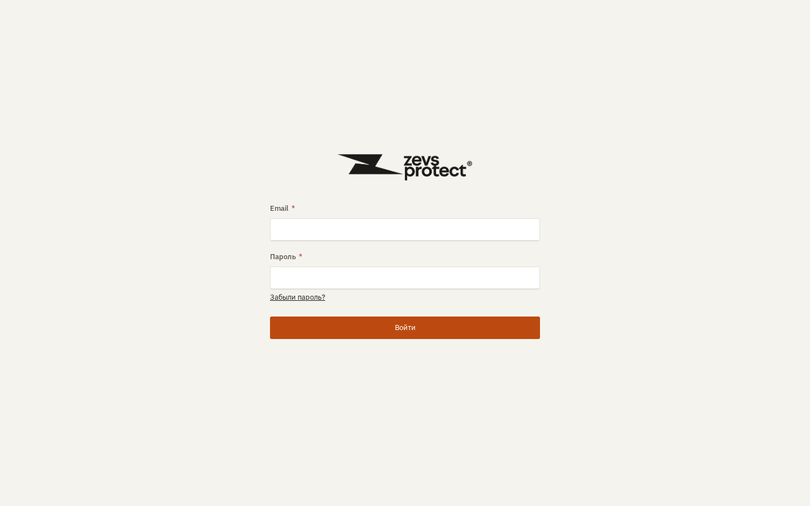

Сотрудников заводит администратор («Система → Пользователи» → «Создать»). Покупатели в админку не входят.

| Роль | Что видит в меню |
|---|---|
| **Администратор** | Всё: каталог, контент, продажи, пользователи, настройки |
| **Менеджер** | Заказы, заявки, клиенты, отзывы, настройки (просмотр); каталог и контент — только просмотр |
| **Контент-менеджер** | Модели, категории, медиа, статьи, страницы, «Главная», «О компании», «Доставка». Заказов и заявок нет |

Меню слева показывает только то, что доступно вашей роли.

| Менеджер | Контент-менеджер |
|---|---|
| 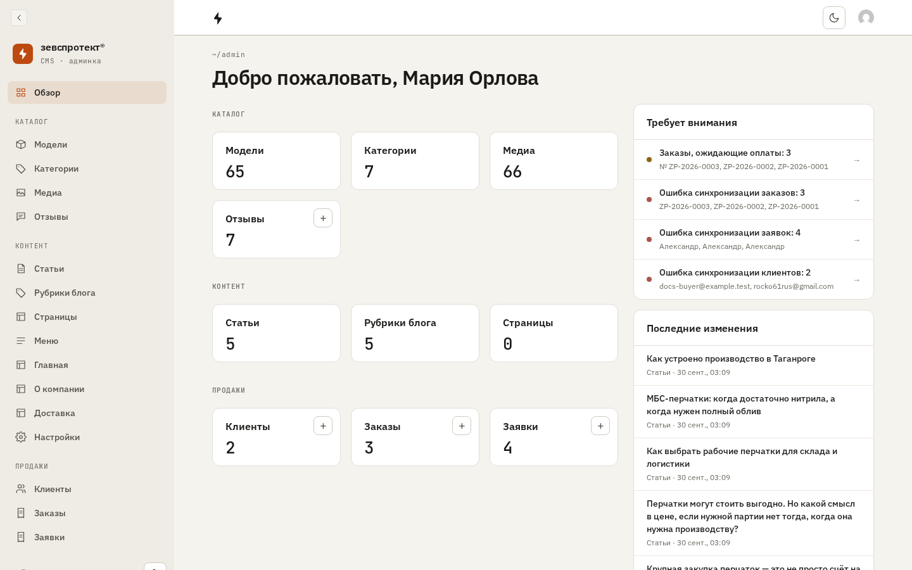 | 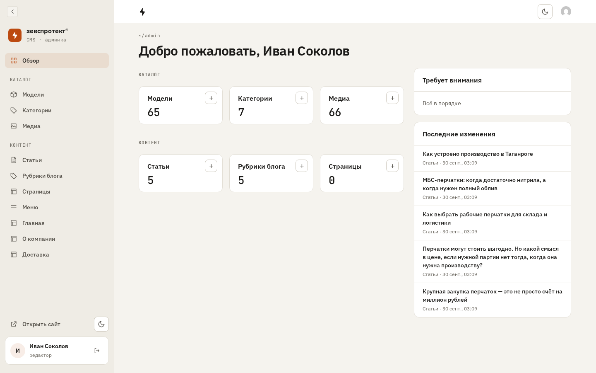 |

---

## 2. Сводка: с чего начать день

После входа открывается **Обзор**.

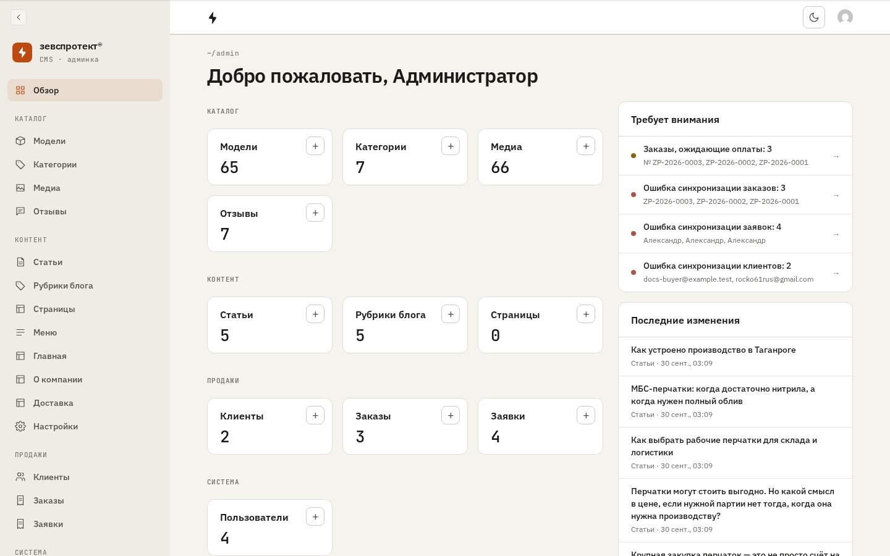

- Плитки со счётчиками ведут в разделы: модели, категории, заказы, заявки, клиенты.
- Блок **«Требует внимания»**: заказы, ожидающие оплаты; ошибки синхронизации с Битрикс24 по заказам, заявкам и клиентам; модели в черновиках. Нажмите на строку — откроется нужный документ.
- **«Последние изменения»** — что правили коллеги.

---

## 3. Заказы

**Продажи → Заказы.** Номер вида `ZP-2026-0003`.

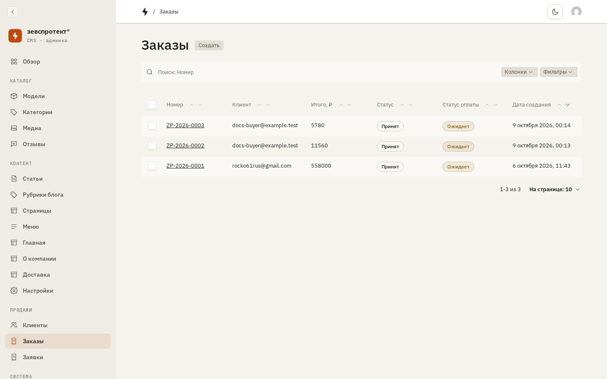

В списке — номер, клиент, сумма, **статус** и **статус оплаты**. Нажмите на номер.

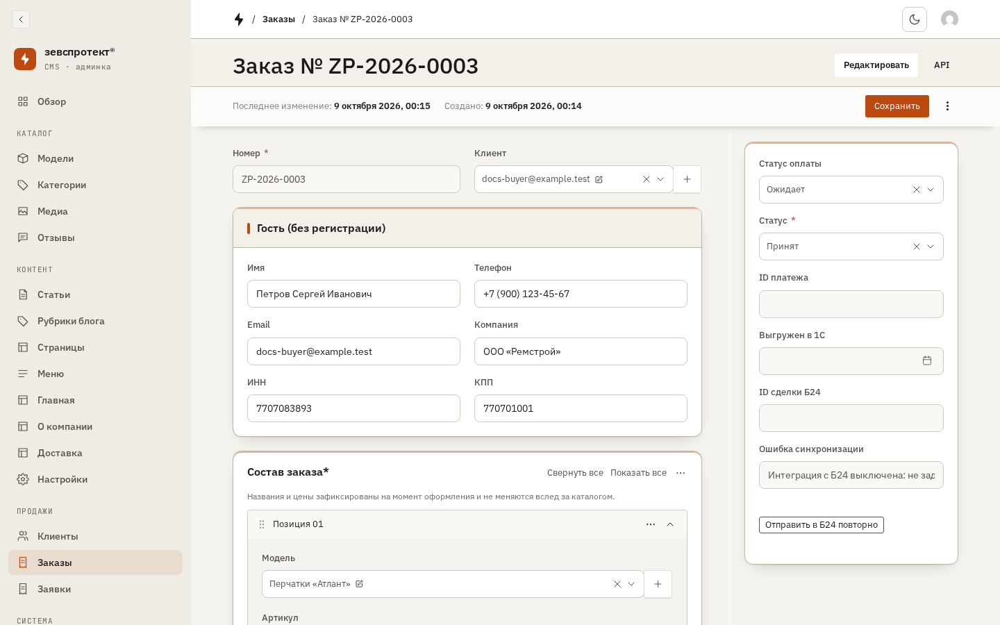

В карточке:
- **Клиент** (зарегистрированный) или блок «Гость (без регистрации)» с именем, телефоном, email, компанией, ИНН и КПП.
- **Состав заказа** — названия и цены зафиксированы на момент оформления и не меняются, если потом изменится каталог.
- **Итого** считается автоматически: позиции плюс доставка.
- **Доставка:** город, способ, перевозчик, адрес, стоимость.
- Справа — **статус**, **статус оплаты**, идентификаторы Битрикс24 и 1С, ошибка синхронизации.

### Сменить статус заказа

1. Откройте заказ.
2. В правой колонке выберите **«Статус»**: Принят → Комплектуется → Отгружен → В доставке → Доставлен (или Отменён).
3. При необходимости обновите **«Статус оплаты»**: Ожидает, Счёт выставлен, Оплачен, Ошибка.
4. Нажмите **«Сохранить»**.

Каждое изменение пишется в **«История статусов»**. Клиент видит новый статус в кабинете и на странице отслеживания. Если в Битрикс24 настроено соответствие стадий (см. [§9](#9-битрикс24-и-1с)), статус меняется сам вслед за стадией сделки — вручную правьте только исключения.

### Вписать стоимость доставки

Сайт доставку не считает — клиент видит «рассчитает менеджер». Согласуйте цену с клиентом и впишите её в **«Доставка → Стоимость, ₽»**; итог пересчитается при сохранении.

### Полный вид карточки

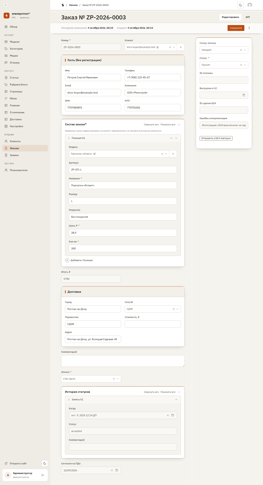

> После изменения состава, клиента, доставки, оплаты или статуса заказ снова встаёт в очередь выгрузки в 1С — это нормально.

Удалять заказы может только администратор; обычно достаточно статуса «Отменён».

---

## 4. Заявки с сайта

**Продажи → Заявки.** Сюда приходят все формы сайта: обратная связь, расчёт поставки, образцы, консультация, запрос по товару, запрос прайс-листа и заявка из корзины.

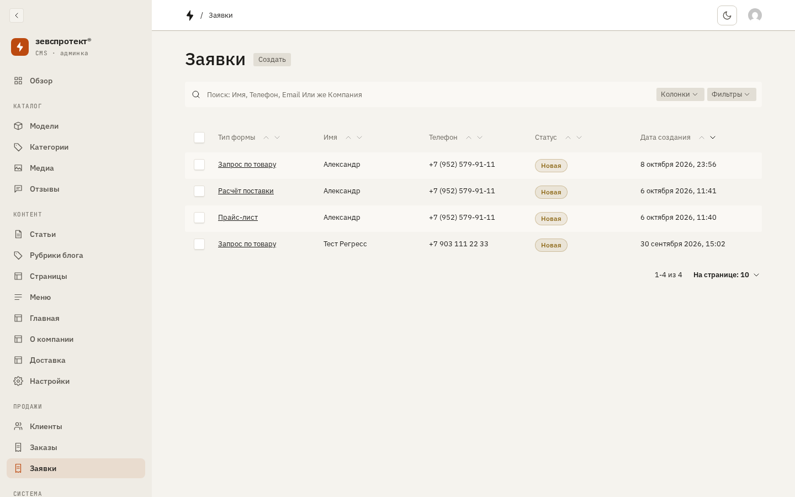

Откройте заявку: видны тип формы, контакты, сообщение, страница отправки и дата согласия на обработку данных.

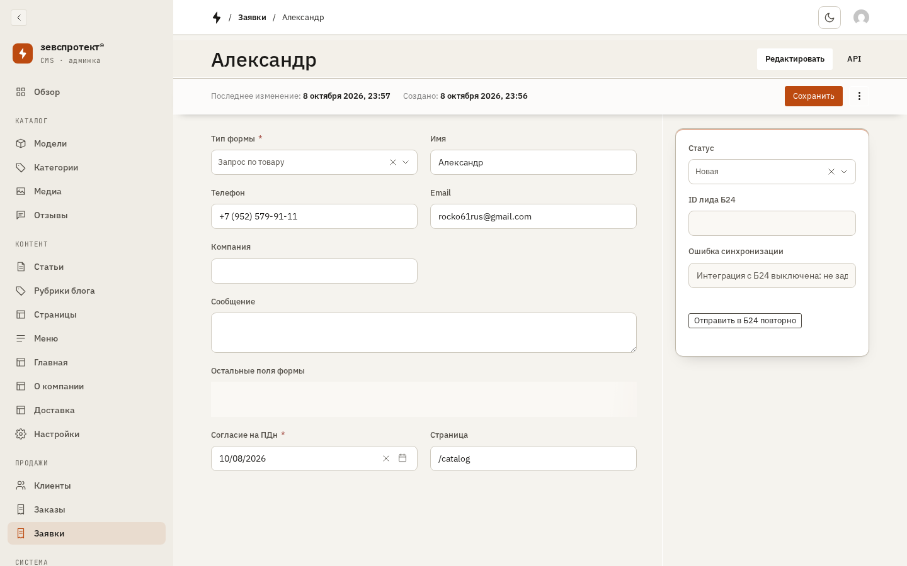

Обработали — поставьте **«Статус» → «Обработана»** и сохраните. Письмо о новой заявке уходит на адрес из «Настройки → Контакты» (или `LEADS_EMAIL` на сервере).

---

## 5. Клиенты

**Продажи → Клиенты** — зарегистрированные покупатели: тип (частное / юридическое лицо), ФИО, телефон, организация, ИНН, КПП, адреса доставки, реквизиты и избранное.

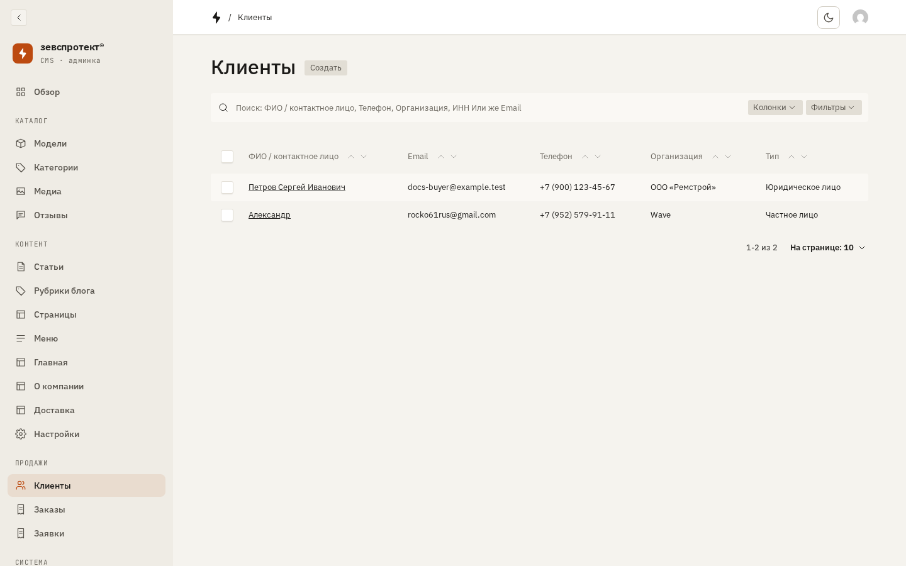

Пароли клиентов не видны. Клиент меняет пароль сам («Забыли пароль» на сайте или в профиле кабинета).

---

## 6. Отзывы: модерация

Отзывы с карточек товаров приходят на модерацию и **на сайте не видны, пока не отмечено «Одобрен»**.

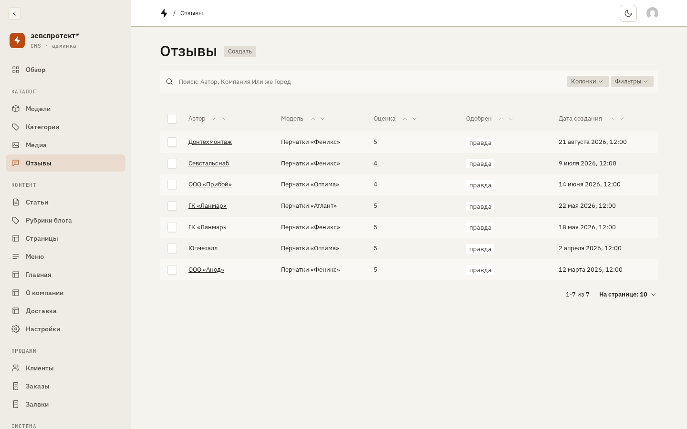

1. Откройте **Каталог → Отзывы**. В колонке «Одобрен» видно, какие ещё ждут решения.
2. Откройте отзыв, проверьте текст, при необходимости поправьте опечатки.
3. Включите **«Одобрен»** (справа) и нажмите **«Сохранить»**.

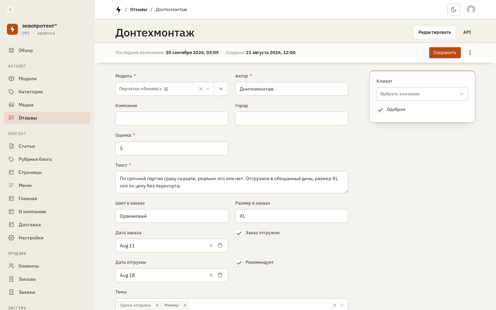

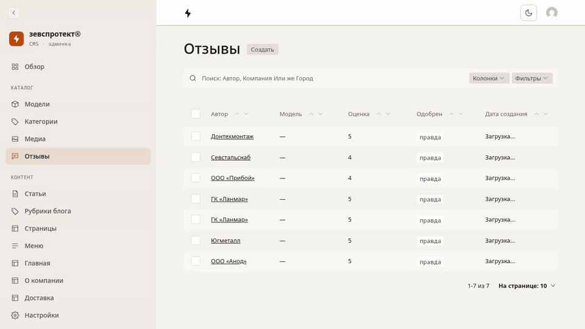

Чтобы скрыть отзыв, снимите одобрение или удалите его.

---

## 7. Каталог: модели, категории, медиа

### Список моделей

**Каталог → Модели.** Поиск по названию, slug и артикулу; фильтры и колонки — над таблицей.

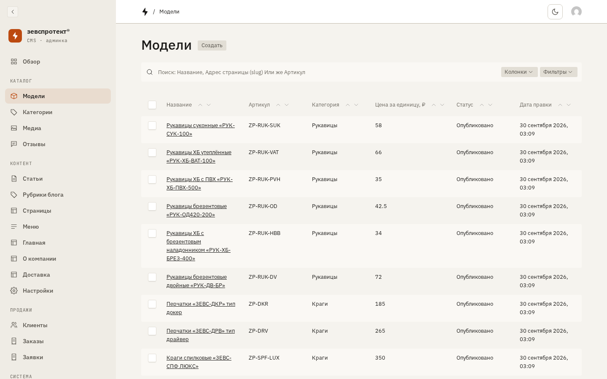

### Открыть и править модель

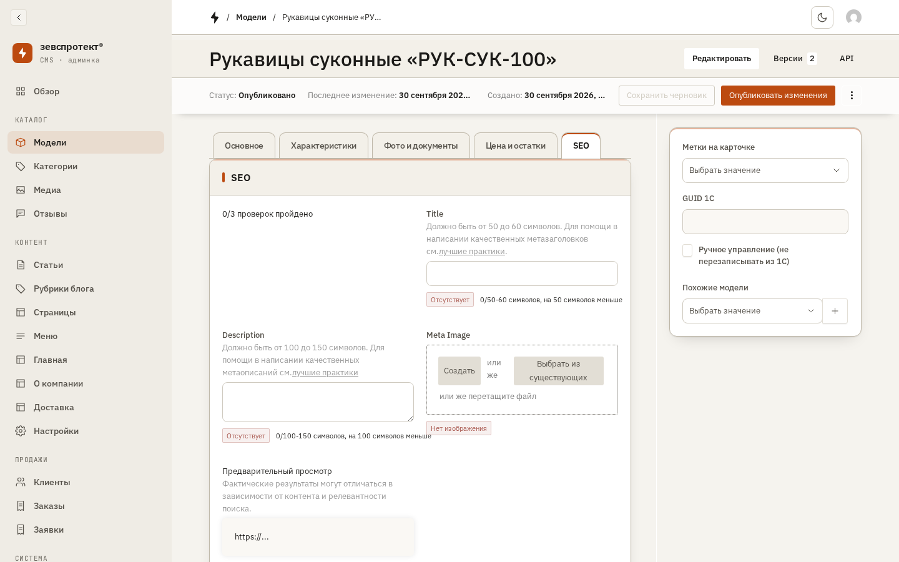

У модели пять вкладок:

| Вкладка | Что в ней |
|---|---|
| **Основное** | Название, адрес страницы (slug), артикул, категория, описание |
| **Характеристики** | Основа, покрытие, цвета, размеры, класс вязки, ТЕКС, вес пары, длина — по ним работают фильтры каталога |
| **Фото и документы** | Галерея (первое фото — главное) и декларации соответствия (PDF) |
| **Цена и остатки** | Цена за единицу, наличие, единица, минимальный заказ, кратность упаковки |
| **SEO** | Заголовок и описание для поисковиков (пусто — берутся название и описание) |

| Характеристики | Фото и документы |
|---|---|
| 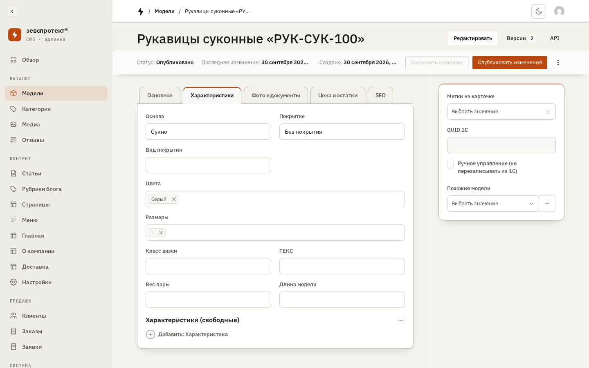 | 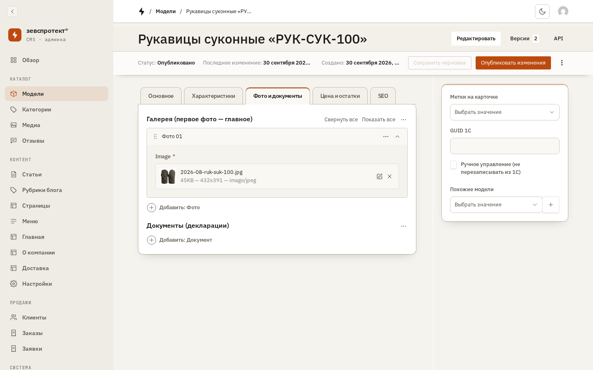 |

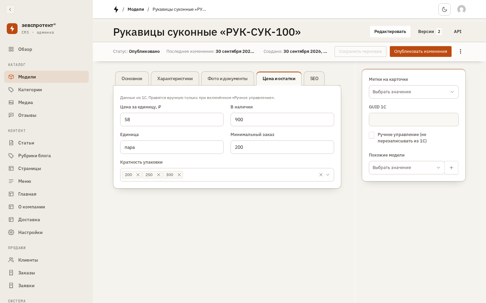

Справа: **метки на карточке** (Хит, Новинка, Акция, «Избранное на главной»), **«Ручное управление»**, похожие модели, GUID 1С (только чтение).

### Опубликовать изменения

Сверху два действия:
- **«Сохранить черновик»** — изменения видны только в админке.
- **«Опубликовать изменения»** — модель обновляется на сайте в течение нескольких секунд.

**«Отменить публикацию»** убирает модель с сайта: её нельзя будет положить в корзину и заказать. Предыдущие состояния — во вкладке **«Версии»** (хранится 20), кнопка «Восстановить эту версию».

### Цены из 1С

Модели, выгруженные из 1С (заполнен «GUID 1С»), получают название, характеристики, фото, цену и остаток при каждом обмене. Поэтому **цена, остаток и единица у них не редактируются**: правьте цену в 1С.

Если нужно временно держать свои данные (спеццена, ручное описание), включите **«Ручное управление (не перезаписывать из 1С)»** — обмен перестанет менять эти поля. Не забудьте выключить, когда вернётесь к данным 1С. У моделей, заведённых вручную (без GUID), цена правится всегда.

### Создать модель

**Модели → «Создать»**, заполните вкладки и нажмите «Опубликовать».

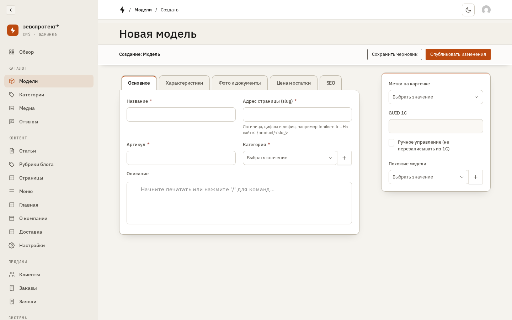

Удалить модель может только администратор. Лучше снимать с публикации: при удалении старые заказы теряют ссылку на модель (название и цена в них сохраняются).

### Категории

**Каталог → Категории:** название, slug, короткое название, родитель, картинка и «Порядок» (меньше число — выше в списке).

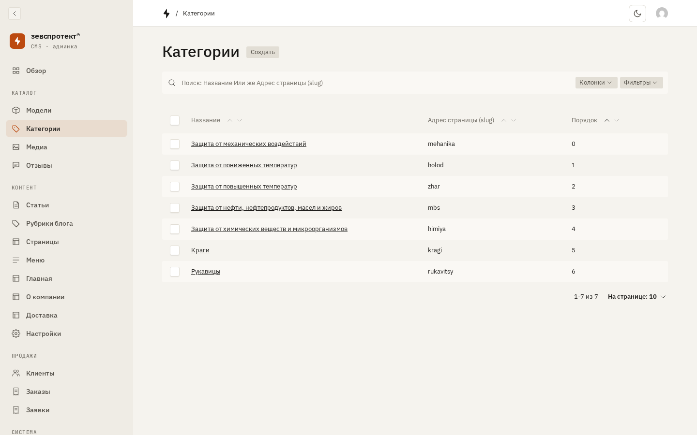

### Медиа

**Каталог → Медиа** — все картинки и файлы. Форматы: JPG, PNG, WebP, PDF, DOCX, XLSX; картинки до 10 МБ, файлы до 25 МБ. Для картинок обязателен **Alt-текст** (описание для поисковиков и незрячих).

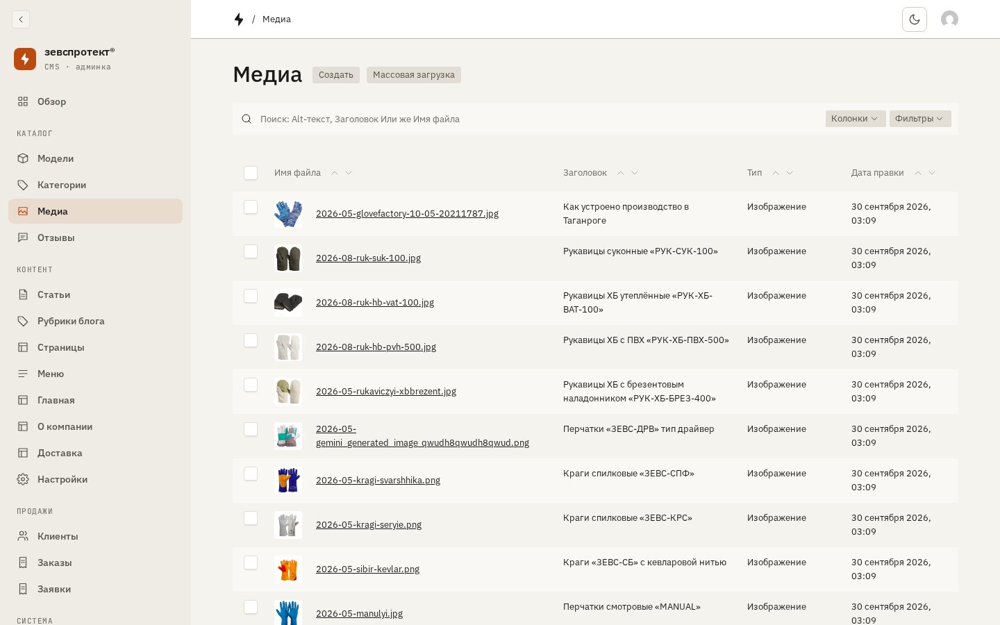

Загрузить файл можно здесь («Создать») или прямо из поля модели или статьи — он тоже попадёт в «Медиа».

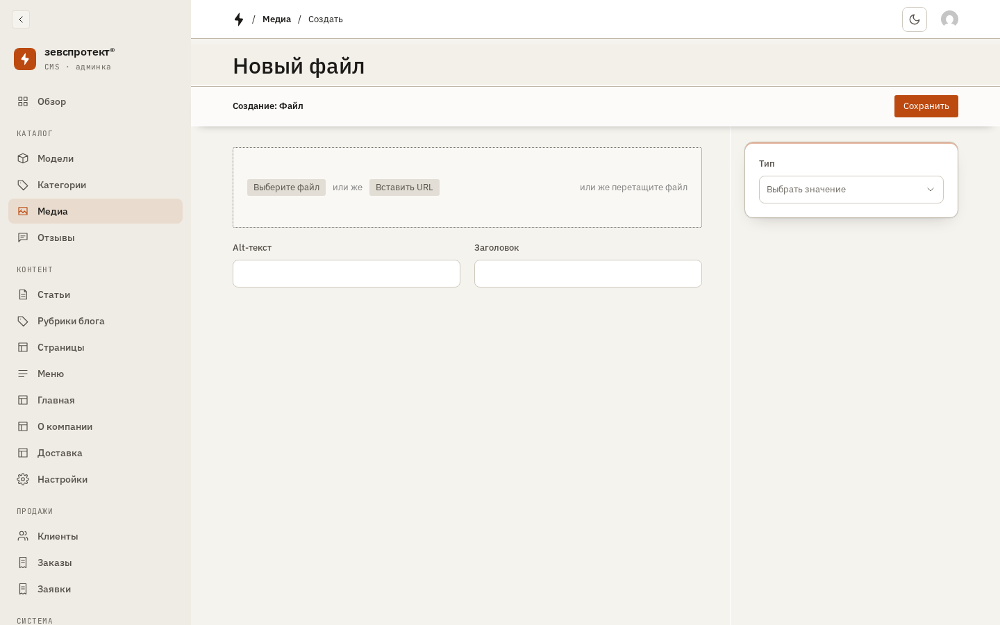

---

## 8. Контент: статьи, главная, страницы

### Статьи блога

**Контент → Статьи:** заголовок, slug, рубрика, обложка (показывается **целиком, без обрезки** — загружайте в исходных пропорциях), обязательный анонс, текст, слайды. Справа — дата публикации, «Показывать на главной», связанные статьи.

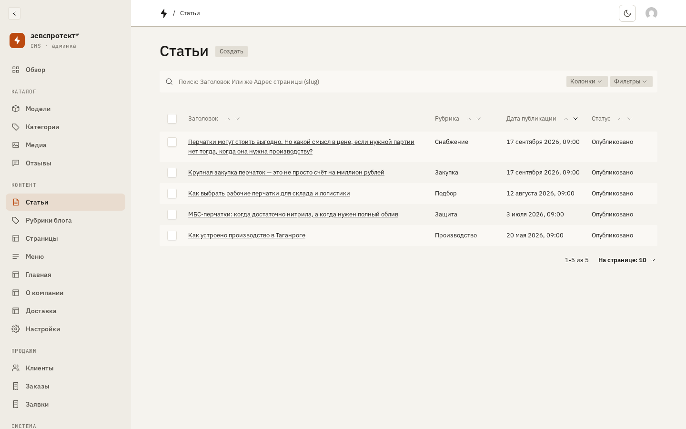

### Главная

**Контент → Главная** — заголовок первого экрана, цифры, блок «О компании», «Почему закупают у нас», условия покупки, доска отзывов, бегущая строка клиентов, товары и статьи на главной, баннеры.

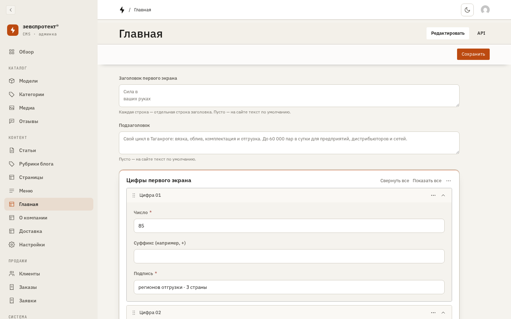

> **Правило для «Главная», «О компании», «Доставка», «Контакты»: пустое поле — на сайте текст по умолчанию** (подсказка серым в поле). Правки появляются на сайте через несколько секунд после «Сохранить» (в крайнем случае — до 5 минут).

### О компании и Доставка

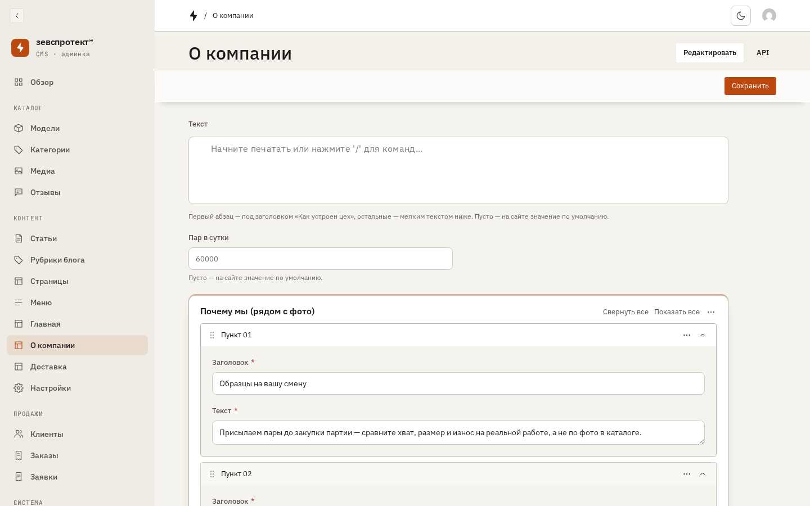

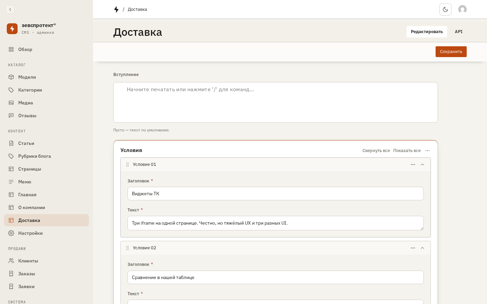

### Настройки

**Контент → Настройки** (правит администратор): телефон, email, адрес, ссылка на MAX, часы работы, отделы для страницы «Контакты», счётчики и соответствие стадий Битрикс24 статусам заказов.

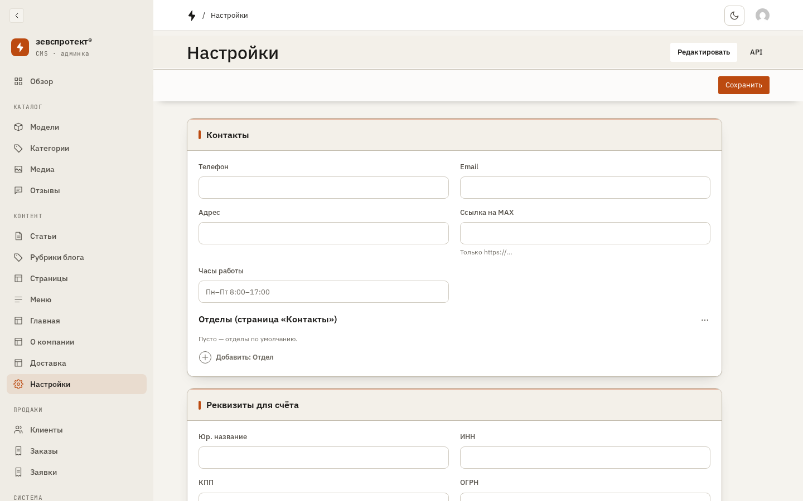

---

## 9. Битрикс24 и 1С

### Битрикс24

Новые заказы, заявки и клиенты автоматически отправляются в Б24 (сделка, лид, компания/контакт) в течение минуты. При сбое система повторяет отправку с нарастающей паузой (до 8 попыток). Успех — заполненные «ID сделки Б24» и «ID лида Б24».

**Если отправка не удалась,** в документе справа заполнено поле «Ошибка синхронизации» с причиной, а на сводке есть пометка. Что делать:

1. Откройте документ с ошибкой (из блока «Требует внимания»).
2. Устраните причину (например, администратор чинит вебхук Б24).
3. Нажмите **«Отправить в Б24 повторно»** справа. Появится «Поставлено в очередь — отправка в течение минуты».

Дубль в Б24 кнопка не создаёт: если отправка уже прошла, ответ — «Уже в Б24, повтор не нужен».

### Стадии Б24 → статус заказа

Внизу «Настройки» добавьте строки: «Стадия сделки Б24» (ID стадии, например `C1:PREPAYMENT_INVOICE`) → «Статус заказа» и при необходимости «Статус оплаты». Стадия без строки заказ не меняет.

### 1С

Каталог (модели, категории, цены, остатки, фото) и заказы обмениваются по расписанию узла «Обмен с сайтом» в 1С. Цены правьте в 1С.

---

## 10. Частые вопросы

**Изменил модель, а на сайте старое.** Проверьте, что нажато «Опубликовать изменения», а не «Сохранить черновик». Обновите страницу через несколько секунд.

**Цена не редактируется.** Модель из 1С: меняйте цену в 1С или включите «Ручное управление».

**Отзыв не появился на сайте.** Нужна отметка «Одобрен» и «Сохранить».

**Не вижу заказов и заявок.** У роли «Контент-менеджер» их нет. Обратитесь к администратору.

**На сводке «Ошибка синхронизации».** См. [§9](#9-битрикс24-и-1с): исправьте причину и нажмите «Отправить в Б24 повторно».

**Хочу вернуть прежнее описание модели.** Вкладка «Версии» → нужная версия → «Восстановить эту версию».
